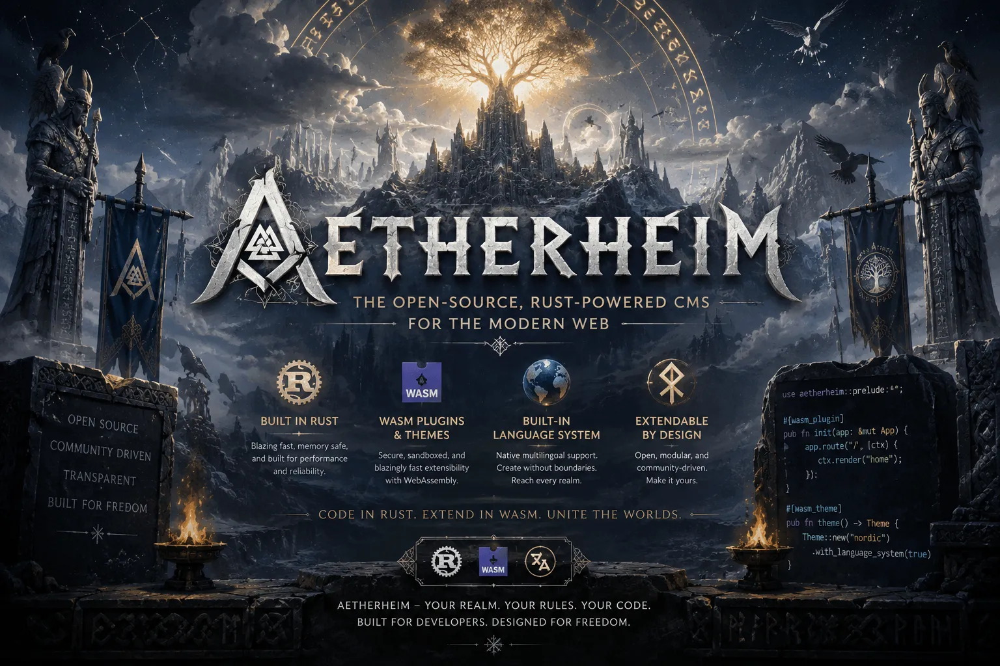

<p align="center">
  <b>Security-first, API-native content operating system in Rust.</b><br>
  Easy at the surface, typed and portable at the core, capability-secure at extension boundaries.
</p>

<div align="center">
  <a href="docs/IMPLEMENTATION_PLAN.md">Implementation Plan</a>
  ·
  <a href="docs/RELEASE_PLAN.md">Release Plan</a>
  ·
  <a href="docs/threat-model.md">Threat Model</a>
  ·
  <a href="SECURITY.md">Security</a>
</div>

<br>

<p align="center">
  <a href="https://github.com/valkyoth/aetherheim">
    
  </a>
</p>

# Aetherheim

Aetherheim is a planned self-hostable content operating system: structured
content, themes, capability-bound plugins, multilingual and multi-domain
publishing, media, memberships, commerce, portable data, and verifiable
operations in one modular product.

The project is being built in small independently reviewable releases. Version
`0.1.0` is only the repository and contract foundation. It is not yet a CMS,
web server, database, authentication system, plugin host, or production
application.

## Current Status

| Area | Status | Current scope |
| --- | --- | --- |
| Rust workspace | Active foundation | Main facade/binary and focused support crates |
| `no_std` contracts | Active foundation | Bounds, identifiers, product modes, and proof labels |
| External Rust crates | Minimal and reviewed | Added only after discussion, exact pinning, admission review, and boundary tests |
| crates.io publishing | Disabled | Every package has `publish = false` |
| HTTP, storage, rendering, admin UI | Not implemented | Planned in small pre-1.0 milestones |
| Themes and plugins | Not implemented | Contracts precede sandbox/runtime work |
| Skrifheim integration | Deferred | Optional post-1.0 only after both projects are stable |
| Production readiness | Not ready | `1.0.0` is the first serious production target |

## Design Commitments

- One operationally simple product built as a modular Cargo workspace.
- A structured block/document tree is canonical; HTML is output.
- APIs are first-class contracts used by the UI, CLI, integrations, and SDKs.
- Plugins receive narrow named capabilities and never raw storage or ambient
  host authority.
- SQLite is the simple default; PostgreSQL is the production reference;
  MariaDB, MongoDB, and SurrealDB must pass the same portable conformance
  contract before support is claimed.
- Optional Valkey cache offload, multi-node operation, OpenBao secret bootstrap,
  and Fluxheim proxy/load-balancer deployments have separate fail-closed
  qualification gates; none is required for a simple installation.
- Aetherheim uses the reviewed `sanitization` crate for secret memory and bans
  direct or transitive `zeroize`; sanitization is proportional to credible
  secret lifetime and exposure risk.
- `no_std` is required for portable domain and proof contracts where practical.
- Security-sensitive behavior stays fail closed until its implementation,
  tests, threat review, and applicable individual or authorised cumulative
  pentest are complete.
- External crates are used only where they materially improve correctness,
  security, interoperability, or maintainability. Every addition is discussed
  first and entered in the dependency admission register.
- Normal Rust source files may never exceed 500 lines.

## Platform Direction

Linux, Windows, FreeBSD/NetBSD, macOS, Android, and iOS are supported targets
from the foundation. Core `no_std` contracts are also checked independently so
the architecture does not become locked to one operating system. Aesynx does
not yet exist as a usable operating system or Rust target; it is only a possible
future adapter and is not a present dependency, build target, or support claim.

## Build

Install the pinned Rust toolchain, then run:

```bash
cargo build --workspace
cargo test --workspace
scripts/checks.sh
scripts/acceptance.sh all
```

The full repository gate also requires the exact release tools pinned in CI:
`cargo-deny 0.20.2`, `cargo-audit 0.22.2`, and `cargo-sbom 0.10.0`.

The current CLI exposes only truthful foundation diagnostics:

```bash
cargo run -p aetherheim -- doctor
```

The current foundation happens to have no external crate dependencies. That is
not a promise to reimplement TLS, cryptography, WebAuthn, database clients,
media codecs, or a WebAssembly runtime. See the
[dependency policy](docs/dependency-policy.md).

Operational topology and secret-memory decisions are specified in the
[cache, cluster, and edge plan](docs/operations-topology.md) and
[secret-memory policy](docs/secret-memory-policy.md).
The [acceptance-testing policy](docs/acceptance-testing.md) requires launched
processes and live providers before support can be claimed; mocks alone are not
release evidence.

## Repository Shape

```text
crates/aetherheim             facade and product binary
crates/aetherheim-core        no_std shared product contracts
crates/aetherheim-bounds      no_std untrusted-input bounds
crates/aetherheim-ids         no_std opaque identifier domains
crates/aetherheim-proof-core  no_std proof-readiness contracts
crates/aetherheim-config      host-side typed configuration
crates/aetherheim-testkit     deterministic first-party fixtures
docs/                         architecture, security, and implementation plans
release-notes/                one handoff document per release
security/pentest/             permanent individual or cumulative pentest reports
scripts/                      local policy and release gates
```

New domain or adapter work receives its own focused crate before implementation
would make an existing crate or file difficult to review. See the
[modularity policy](docs/modularity-policy.md).

## Licensing

Aetherheim is licensed under the [European Union Public Licence 1.2](LICENSE).

Themes and plugins made by users are licensed by their authors under whatever
terms they choose. They are not required to use EUPL-1.2 merely because they
interoperate with Aetherheim. Package metadata must identify the applicable
licence, and Aetherheim does not provide legal advice about whether a specific
extension is a derivative work.

## Security

Report vulnerabilities privately as described in [SECURITY.md](SECURITY.md).
Every planned release ends at an implementation stop. The default is one
pentest per release; the user may explicitly authorise up to 15 listed releases
to share one cumulative report. Findings arrive through temporary root
`PENTEST.md`, while permanent history stays under `security/pentest/`. Codex
never tags or pushes until the user explicitly instructs it after GitHub is
green. See the [release workflow](docs/release-workflow.md).
